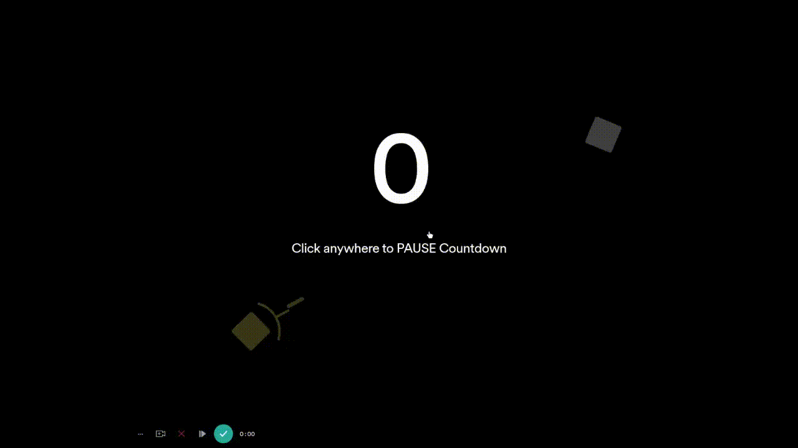

    <h1>Square Shooter 🟩 - Flame 🔥</h1>

    

<h4 align="center"> 
	Ready to play❔❔
</h4>

## ✔ Try it out!!
[Square Shooter - Flame](https://namzug16.github.io/squareshooter_flame/#/) play the game, or just stare at the AI battling 🔫🔫

## About
[Square Shooter - Flame](https://github.com/namzug16/squareshooter_flame) is the
re-implementation of the original [Square Shooter](https://github.com/namzug16/square-shooter) 
using [Flame](https://github.com/flame-engine/flame) 🔥 game engine.

The enemy(agent) AI uses a mix of a Finite State Machine and [Stateless Behavior Trees](https://arxiv.org/abs/2011.03835)

